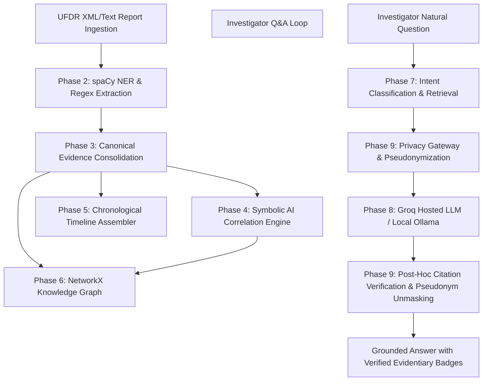

# 🛡️ MHA UFDR Analysis Platform — Smart Automation & Forensic Intelligence

[](https://www.python.org/)
[](https://fastapi.tiangolo.com/)
[](https://reactjs.org/)
[](https://www.typescriptlang.org/)
[](https://groq.com/)
[]()

> **Official Hackathon Submission** for **Smart India Hackathon (SIH) Internal**  
> A Next-Generation Forensic Intelligence Platform for automated ingestion, neural entity extraction, symbolic correlation rule evaluation, identity-pseudonymized privacy gateway, and grounded AI assistant for Universal Forensic Extraction Device Reports (UFDR).

---

## 🎯 Executive Summary & Core Value Proposition

Cellular device extractions (UFDR) generated during criminal investigations contain thousands of pages of raw communications, call logs, location records, and contact networks. Manually reviewing these extractions takes days and risks missing high-priority threat signals.

The **MHA UFDR Analysis Platform** automates forensic data synthesis through a **10-Phase Hybrid AI Pipeline**:
1. **Neural NLP Extraction**: Automatically extracts 9 entity types (Persons, Phones, Emails, Locations, IPs, Dates, URLs, Usernames, Orgs) with exact character-offset provenance.
2. **Ground-Truth Consolidation**: Deduplicates and indexes extracted entities into a canonical forensic database.
3. **Symbolic AI Correlation Engine**: Evaluates 100% explainable, deterministic correlation rules (Same-page co-occurrence, High-frequency location anomalies, Rapid contact bursts).
4. **Privacy Gateway & Pseudonymization**: Intercepts data *before* any LLM dispatch, applying deterministic token mapping (`PERSON_001`, `PHONE_001`) to guarantee **zero PII leakage** to cloud APIs.
5. **Hybrid AI Co-Analyst**: Ultra-fast grounded Q&A powered by **Groq Cloud API** (~1.2s latency) with automatic fallback to **Local Air-Gapped Ollama**.

---

## 🏗️ System Architecture & 10-Phase Forensic Pipeline



### 10 Core Modules:
- **Phase 1 (Report Ingestion)**: Ingests raw multi-page UFDR XML extractions.
- **Phase 2 (Neural Entity Extraction)**: spaCy NLP + Regex pattern extraction with character start/end offsets.
- **Phase 3 (Canonical Evidence Vault)**: Normalized ground-truth storage with immutable audit logging.
- **Phase 4 (Symbolic AI Rule Engine)**: Deterministic derivation of relationship triplets (`USED`, `LOCATED_AT`, `ACCESSED`, `ASSOCIATED_WITH`) and high-severity anomaly findings.
- **Phase 5 (Timeline Stream)**: Chronological event progression with time-window filtering.
- **Phase 6 (Knowledge Graph)**: Interactive NetworkX node-edge graph visualization with Louvain clustering and neighborhood expansion.
- **Phase 7 (Investigator Query Engine)**: Intent classification across 7 query types with candidate entity resolution.
- **Phase 8 (LLM Answer Service)**: Grounded prompt builder enforcing mandatory `[EVT-XXXX]` inline citation badges.
- **Phase 9 (Privacy Gateway)**: Deep-copy pseudonymization and field-level minimization ensuring zero unminimized data reaches external endpoints.
- **Phase 10 (Mission Control Dashboard)**: Unified executive metrics, animated pipeline execution tracker, and category distribution breakdown.

---

## ⚡ Tech Stack & Tools

### Backend Services (`/backend`)
- **Framework**: Python 3.11+ / FastAPI
- **Database**: SQLite3 / SQLAlchemy ORM
- **NLP & Graph Engine**: spaCy 3.7+, NetworkX 3.2+
- **LLM Integration**: Groq API (`openai/gpt-oss-20b`), Ollama Local Client (`llama3:8b`)
- **Testing**: Pytest, HTTPX TestClient, Pairwise & Data-Sensitivity Suites

### Frontend UI (`/frontend`)
- **Framework**: React 18 / TypeScript 5 / Vite
- **Styling**: Cyberpunk High-Contrast Forensic Theme (`index.css` & `tokens.css`)
- **Icons & Visuals**: Lucide React
- **HTTP Client**: Axios with JWT Bearer Interceptors & Auto 401 Handling

---

## 🚀 Quick Start & Installation

### Prerequisites
- Python 3.11 or higher
- Node.js 18+ and npm
- Groq API Key (Sign up free at [console.groq.com](https://console.groq.com))

---

### Step 1: Backend Setup

```bash
# Navigate to backend directory
cd backend

# Create and activate virtual environment
python -m venv venv

# On Windows PowerShell:
.\venv\Scripts\activate

# On Linux/macOS:
source venv/bin/activate

# Install Python dependencies
pip install -r requirements.txt

# Create environment configuration file
cp .env.example .env
```

Edit `.env` to include your Groq API key:
```env
APP_NAME=UFDR Analysis Platform API
ENV=development
API_V1_PREFIX=/api/v1
ALLOWED_ORIGINS=["http://localhost:5173", "http://127.0.0.1:5173"]
DATABASE_URL=sqlite:///./ufdr.db
LOG_LEVEL=INFO

# Groq Hosted API Configuration
EXTERNAL_LLM_API_KEY=your_groq_api_key_here
GROQ_MODEL=openai/gpt-oss-20b
```

Start the backend uvicorn server:
```bash
uvicorn app.main:app --host 127.0.0.1 --port 8000 --reload
```

The API interactive docs will be live at `http://127.0.0.1:8000/docs`.

---

### Step 2: Frontend Setup

Open a new terminal window:

```bash
# Navigate to frontend directory
cd frontend

# Install Node modules
npm install

# Start Vite development server
npm run dev
```

The web UI will be live at `http://localhost:5173`.

#### Demo Credentials:
- **Username**: `investigator`
- **Password**: `demo123`

---

## 🧪 Automated Testing & Verification

The platform contains a 49-case Pytest suite covering authentication, extraction, symbolic engine idempotency, graph expansion, privacy gateway, Groq model dispatch, and data sensitivity.

```bash
cd backend
.\venv\Scripts\pytest -v
```

### Running Data-Sensitivity Verification (`test_no_mock_data.py`)
To prove that all endpoints return 100% database-driven results that vary dynamically per case report (with zero hardcoded mock data):

```bash
.\venv\Scripts\pytest -v -s tests/test_no_mock_data.py
```

---

## 📂 Project Directory Structure

```text
ufdr-analysis-platform/
├── backend/
│   ├── app/
│   │   ├── api/v1/            # API Route Handlers (reports, extraction, evidence, symbolic, etc.)
│   │   ├── core/              # Security, Auth JWT, CORS Settings
│   │   ├── db/                # SQLAlchemy Base & Session SessionLocal
│   │   ├── evidence/          # Canonical Evidence Consolidator
│   │   ├── extraction/        # spaCy NLP & Regex Entity Extraction Engine
│   │   ├── graph/             # NetworkX Graph Builder & Neighborhood Expansion
│   │   ├── llm/               # Groq External Client, Ollama, Grounded Prompts, Citation Verifier
│   │   ├── models/            # SQLAlchemy Database Models (Report, Entity, Evidence, Finding, etc.)
│   │   ├── privacy/           # Privacy Gateway, Pseudonymizer, Minimizer
│   │   ├── query/             # Intent Classifier & Candidate Resolver
│   │   ├── symbolic/          # Deterministic Rule Engine & Anomaly Detectors
│   │   └── timeline/          # Chronological Timeline Stream Assembler
│   ├── tests/                 # Complete Pytest Test Suite (49 passing tests)
│   └── requirements.txt
├── frontend/
│   ├── src/
│   │   ├── api/               # Typed Axios API Client Functions
│   │   ├── components/        # Cyber UI Components (AppShell, LoadingSpinner, EntityTypeFilter, etc.)
│   │   ├── pages/             # Page Views (Dashboard, Entities, Evidence, Findings, Chat, etc.)
│   │   └── styles/            # Cyber Design Tokens & CSS Stylesheet (index.css)
│   ├── package.json
│   └── vite.config.ts
└── README.md
```

---

## 🔒 Security & Privacy Statement

- **Strict Zero-Trust Privacy**: Raw names, phone numbers, emails, and address locations are **never** transmitted over external network boundaries.
- **Deterministic Tokenization**: All identity fields are pseudonymized (`PERSON_001`, `PHONE_001`) before prompt generation.
- **Immutable Chain of Custody**: All evidence access, queries, and AI generation calls produce immutable `AuditLog` rows.

---

## 📜 License & Accreditation

Developed for **Ministry of Home Affairs (India) / Smart India Hackathon**.  
Authorized for forensic investigation research and evaluation.
