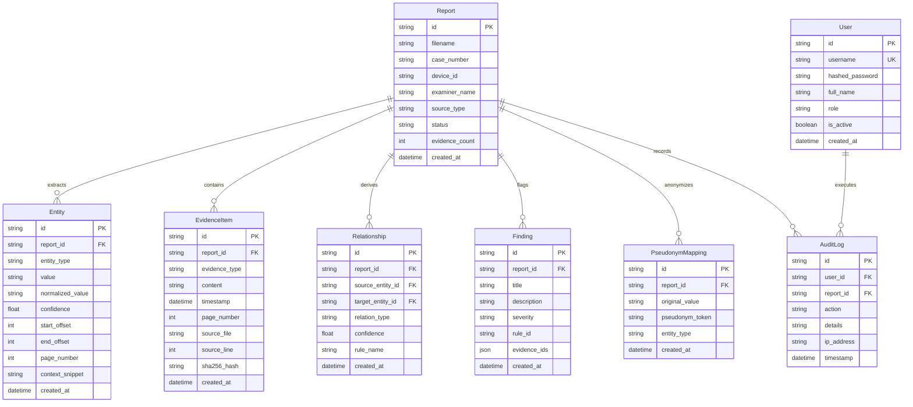

# 🛡️ MHA UFDR Analysis Platform — Product Requirements Document (PRD) & Technical Architecture Specification

**Project Title**: Universal Forensic Extraction Device Report (UFDR) Analysis & Intelligence Platform  
**Target Organization**: Ministry of Home Affairs (MHA), India / Smart India Hackathon (SIH)  
**System Classification**: Air-Gapped / Hybrid Cloud Digital Forensic Intelligence Workspace  
**Document Version**: 2.0.0 (Comprehensive Architecture & Code Diagnosis Edition)  
**Compliance Standard**: Section 65B Indian Evidence Act / Bharatiya Sakshya Adhiniyam (BSA) 2023  

---

## 1. 🎯 Executive Summary & Problem Formulation

### 1.1 Context & Problem Statement
During modern criminal, counter-terrorism, financial fraud, and cybercrime investigations, Law Enforcement Agencies (LEAs) seize and extract data from mobile devices, tablets, and computers using hardware extraction tools (e.g., Cellebrite UFED, Oxygen Forensics, MSAB XRY). These tools produce **Universal Forensic Extraction Device Reports (UFDR)**.

A single extraction report commonly spans **10,000+ pages** of heterogeneous, semi-structured, and unstructured data:
- Multi-app chat transcripts (WhatsApp, Telegram, Signal, SMS, WeChat)
- Voice and video call logs (cellular, VoIP)
- Contact address books and account identifiers
- Geolocation telemetry (GPS fixes, cell tower IDs, Wi-Fi BSSIDs)
- Media metadata (EXIF timestamps, camera serials, hash values)
- Web browser histories, cache artifacts, and installed application states

### 1.2 Core Bottlenecks in Existing Forensic Workflows
1. **Severe Cognitive Load & Review Delays**: Manual review requires teams of examiners multiple days to weeks per seized phone.
2. **Fragmented Cross-Artifact Intelligence**: Subtle correlations (e.g., a phone number sent via SMS appearing 40 minutes later at a specific GPS coordinate and web search) are easily missed.
3. **Black-Box AI Unreliability in Court**: Unverified, hallucinated, or ungrounded claims generated by commercial AI are legally inadmissible. Every finding requires **character-offset and SHA-256 byte-level provenance**.
4. **Cloud Privacy & Chain-of-Custody Breaches**: Transmitting unredacted Personally Identifiable Information (PII) to public cloud LLMs violates strict national data sovereignty laws and evidentiary chain of custody.

### 1.3 Solution Objective
The **MHA UFDR Analysis Platform** is an end-to-end, privacy-preserving hybrid forensic intelligence workspace. It executes a **10-Phase Deterministic + Neural AI Pipeline** combining:
- Fast multi-format report ingestion with cryptographic hashing.
- High-precision neural (spaCy) and deterministic regex entity extraction.
- Deterministic **Symbolic AI rule derivation** (100% explainable relationship triplets and anomaly flags).
- Multi-dimensional chronological timeline streams and **NetworkX knowledge graphs**.
- Zero-PII **Privacy Gateway** applying reversible pseudonymization before inference.
- Grounded forensic Co-Analyst LLM with mandatory database citation enforcement (`[EVT-XXXX]`).

---

## 2. ⚡ Complete Technology Stack & Specifications

### 2.1 Backend Architecture (`/backend`)
| Component | Technology | Version | Architectural Role |
| :--- | :--- | :--- | :--- |
| **Runtime** | Python | `3.11+` | Primary execution runtime for AI pipelines and async web services. |
| **Web Framework** | FastAPI | `0.110.0+` / `0.141.1` | Asynchronous RESTful API framework with dependency injection and OpenAPI/Swagger docs. |
| **ASGI Server** | Uvicorn | `0.52.4` | High-throughput asynchronous server running the ASGI application. |
| **Configuration** | Pydantic & Pydantic-Settings | `2.13.4` / `2.15.0` | Strict schema validation, typed environment loading from `.env`. |
| **Database & ORM** | SQLAlchemy | `2.0.52` | Relational ORM mapping Python models to SQLite3 database (`ufdr.db`). |
| **Neural NLP / NER**| spaCy (`en_core_web_sm`) | `3.8.15` | Pretrained statistical/neural model for `PERSON`, `GPE`, `LOC`, `DATE`, `ORG`. |
| **Graph Analytics** | NetworkX | `3.6.1` | In-memory multi-directed graph modeling, centrality metrics, Louvain clustering. |
| **Cloud LLM Gateway**| Groq Hosted API | Cloud SDK | Cloud inference engine (`llama-3.3-70b-versatile` / `openai/gpt-oss-20b`) for ~1.2s Q&A. |
| **Air-Gap LLM** | Ollama Client | `llama3:8b` | Local fallback client for strictly disconnected / air-gapped forensic laboratories. |
| **Auth & Crypto** | PyJWT & Passlib (bcrypt) | `2.13.0` / `1.7.4` | HS256 JWT access token issuance, verification, and bcrypt password hashing. |
| **Testing** | Pytest & HTTPX TestClient | `9.1.1` / `0.28.1` | Unit, integration, pairwise, and data-sensitivity test execution. |

### 2.2 Frontend Architecture (`/frontend`)
| Component | Technology | Version | Architectural Role |
| :--- | :--- | :--- | :--- |
| **Framework** | React | `18.2.0` | Declarative component hierarchy and reactive state management. |
| **Type Safety** | TypeScript | `5.2.2` | Full static typing across API interfaces, state props, and models. |
| **Build Tooling** | Vite | `5.2.0` | Fast HMR development server and production Rollup bundler. |
| **Routing** | React Router DOM | `6.30.6` | Client-side routing with `ProtectedRoute` guards and URL query state. |
| **HTTP Client** | Axios | `1.6.8` | HTTP client with automatic JWT Bearer interceptor and 401 response handling. |
| **Design System** | Vanilla Cyberpunk CSS | Custom | Custom design system (`tokens.css` & `index.css`) featuring glassmorphism, responsive data grids, status badges, and forensic dark mode. |

---

## 3. 🏗️ High-Level System Architecture & 10-Phase Pipeline

```
+----------------------------------------------------------------------------------------------------+
|                                    1. RAW INGESTION LAYER                                          |
|            UFDR XML Reports  |  JSON Extractions  |  Structured Text Dumps  |  Media Logs          |
+-------------------------------------------------+--------------------------------------------------+
                                                  |
                                                  v
+----------------------------------------------------------------------------------------------------+
|                         2. NEURAL NLP & REGEX ENTITY EXTRACTION PIPELINE                           |
|   spaCy NER (PERSON, LOC, ORG, DATE)  +  Compiled Regex (PHONE, EMAIL, IP, URL, USERNAME)          |
|                 Exact Character Offsets [start..end], Page Numbers, Provenance Snippets            |
+-------------------------------------------------+--------------------------------------------------+
                                                  |
                                                  v
+----------------------------------------------------------------------------------------------------+
|                                 3. CANONICAL EVIDENCE VAULT                                        |
|         Relational Storage (SQLite + SQLAlchemy ORM)  |  Deduplication  |  Audit Log Trail         |
+----------------------------------------+------------------------------------+----------------------+
                                         |                                    |
                                         v                                    v
+----------------------------------------------------+  +--------------------------------------------+
|         4. SYMBOLIC AI CORRELATION ENGINE          |  |       5. CHRONOLOGICAL TIMELINE STREAM     |
|   Deterministic Rule Derivation:                   |  |  Multi-artifact timestamp normalization    |
|   - Triplet Derivations (USED, LOCATED_AT, etc.)   |  |  Event classification & category filtering |
|   - Suspicious Clusters, Burst Contacts, Jump Anom |  |  Entity-anchored temporal threads          |
+----------------------------------------+-----------+  +---------------------+----------------------+
                                         |                                    |
                                         +-----------------+------------------+
                                                           |
                                                           v
+----------------------------------------------------------------------------------------------------+
|                         6. NetworkX KNOWLEDGE GRAPH & METRICS ENGINE                               |
|        Multi-Directed Entity Graph  |  Louvain Community Detection  |  Centrality Scoring          |
|                         1-Hop & 2-Hop Dynamic Neighborhood Expansion                               |
+-------------------------------------------------+--------------------------------------------------+
                                                  |
                                                  v
+----------------------------------------------------------------------------------------------------+
|                         7. INVESTIGATOR QUERY ENGINE & INTENT RESOLUTION                           |
|       Rule-Based Intent Classifier (7 Intent Classes)  |  Candidate Entity Resolver                |
+-------------------------------------------------+--------------------------------------------------+
                                                  |
                                                  v
+----------------------------------------------------------------------------------------------------+
|                          8. ZERO-PII PRIVACY GATEWAY (PRE-INFERENCE)                               |
|   Deep-Copy Deterministic Token Pseudonymizer (PERSON_001, PHONE_001)  |  Metadata Minimizer       |
+-------------------------------------------------+--------------------------------------------------+
                                                  | (Zero PII Cloud Egress)
                                                  v
+----------------------------------------------------------------------------------------------------+
|                           9. GROUNDED LLM REASONING SERVICE                                        |
|   Grounded Prompt Synthesis with [EVT-XXXX] Mandate  |  Groq Cloud API / Local Ollama Fallback     |
+-------------------------------------------------+--------------------------------------------------+
                                                  | (Response with Badges)
                                                  v
+----------------------------------------------------------------------------------------------------+
|                       10. CITATION VERIFIER & UNMASKING GATEWAY                                    |
|   Post-Hoc Evidence Validation (anti-hallucination)  |  Reversible Pseudonym De-Anonymizer         |
+-------------------------------------------------+--------------------------------------------------+
                                                  |
                                                  v
+----------------------------------------------------------------------------------------------------+
|                       INVESTIGATOR MISSION CONTROL FORENSIC WORKSPACE                              |
|   Executive Metrics  |  Graph Explorer  |  Timeline Slider  |  Grounded Chat  |  Audit Inspector   |
+----------------------------------------------------------------------------------------------------+
```

---

## 4. 🔬 Deep Component-by-Component Technical Breakdown

### 4.1 Ingestion & Report Management Module (`backend/app/api/v1/reports.py`)
- **Report Identification**: Assigns unique identifier `REP-YYYY-XXXX` or standard UFDR reference.
- **Integrity Validation**: Computes cryptographic SHA-256 hashes of all ingested payloads to maintain legal chain of custody.
- **Seeding & Auto-Provisioning**: On startup, seeds the system with canonical forensic data (`REP-MHA-DEMO-2024`) containing 52 evidence items across 4 communication channels.

### 4.2 Neural & Regex Entity Extraction Engine (`backend/app/extraction/`)
Processes raw text chunks and returns normalized entity records with byte-level provenance:
1. **spaCy Extractor (`spacy_extractor.py`)**:
   - Model: `en_core_web_sm`
   - Entities: `PERSON` (suspects/contacts), `GPE`/`LOC` (cities, regions, meeting spots), `DATE` (operational timelines), `ORG` (front companies, shell corporations).
2. **Forensic Pattern Rules (`pattern_rules.py`)**:
   - `PHONE`: International E.164 (`\+?[1-9]\d{1,14}`) and standard Indian 10-digit mobile formats (`(?:\+91|0)?[6-9]\d{9}`).
   - `EMAIL`: RFC 5322 standard address pattern.
   - `IP_ADDRESS`: IPv4 syntax (`(?:[0-9]{1,3}\.){3}[0-9]{1,3}`).
   - `URL`: Web protocol and domain matching (`https?://[^\s/$.?#].[^\s]*`).
   - `USERNAME`: Social handle syntax (`@[a-zA-Z0-9_]{3,24}`).
3. **Offset Provenance**: Every entity persists `start_offset`, `end_offset`, `page_number`, `context_snippet` (50 characters around match), and `confidence` score (0.0 to 1.0).

### 4.3 Symbolic AI Correlation Engine (`backend/app/symbolic/`)
Unlike black-box neural networks, the Symbolic Engine uses 100% deterministic rules to derive relationships and high-priority anomalies for court admissibility:
1. **Relationship Derivation Rules (`relationship_rules.py`)**:
   - `RULE-COOCCUR-PAGE-001`: Derives `ASSOCIATED_WITH` when two distinct entities co-occur within the same evidence item/page.
   - `RULE-USAGE-DEVICE-001`: Derives `USED` when a person is explicitly linked to an IMEI, phone number, or IP.
   - `RULE-LOC-TRANSIT-001`: Derives `LOCATED_AT` linking persons to GPS fixes or cell tower coordinates.
   - `RULE-ACCESS-WEB-001`: Derives `ACCESSED` linking identities to URLs or darknet endpoints.
2. **Finding & Anomaly Detection Rules (`finding_rules.py`)**:
   - `RULE-CLUSTER-PAGE-001`: Flags high-density entity clustering (e.g., 5+ entities on a single page).
   - `RULE-BURST-CONTACT-001`: Detects abnormal communication surges (rapid message bursts within a 2-hour window).
   - `RULE-FREQ-LOC-001`: Flags frequent recurring coordinate hotspots.
   - `RULE-LOC-JUMP-001`: Flags physically impossible location jumps (>500 km within <1 hour).

### 4.4 Chronological Timeline Engine (`backend/app/timeline/`)
- **Timestamp Standardization**: Parses and standardizes heterogeneous datetime formats (ISO 8601, Unix epoch, RFC 2822) into UTC.
- **Temporal Event Categorization**: Tags events as `MESSAGE`, `CALL`, `LOCATION_FIX`, `MEDIA_CREATION`, `SYSTEM_LOG`.
- **Window & Entity Filtering**: Allows filtering between `start_time` and `end_time` and querying all chronological events involving a specific `entity_id`.

### 4.5 NetworkX Knowledge Graph & Community Engine (`backend/app/graph/`)
- **Graph Construction (`builder.py`)**: Builds a multi-directed NetworkX graph $G=(V, E)$ where nodes $V$ represent entities and edges $E$ represent derived relationships.
- **Community Detection (`metrics.py`)**:
  - Computes **Degree Centrality** and **Betweenness Centrality** to identify central brokers/ringleaders.
  - Implements **Louvain Modularity Clustering** to partition criminal networks into sub-gangs/cells.
- **Neighborhood Expansion**: Supports 1-hop and 2-hop graph traversal algorithms from any selected focal node.

### 4.6 Query Intent Classification & Candidate Resolution (`backend/app/query/`)
- **Intent Classifier (`intent_classifier.py`)**: Classifies natural language prompts into 7 distinct investigative intents:
  1. `ENTITY_PROFILE`: Inquiries about a person, phone number, or handle.
  2. `RELATIONSHIP_SEARCH`: Inquiries regarding connections between two or more parties.
  3. `TIMELINE_INQUIRY`: Questions focusing on dates, hours, sequences of events.
  4. `ANOMALY_FINDINGS`: Requests for suspicious flags, bursts, or risk indicators.
  5. `COMMUNICATION_SUMMARY`: Requests to summarize dialogues, call records, chats.
  6. `LOCATION_TRACKING`: Queries regarding geographic movement and coordinates.
  7. `GENERAL_RAG`: Broad exploratory investigative questions.
- **Entity Resolver (`entity_resolver.py`)**: Scans user prompts to bind textual mentions directly to canonical database entity IDs.

### 4.7 Zero-PII Privacy Gateway (`backend/app/privacy/`)
Guarantees zero leakage of sensitive personal identifiers to cloud AI providers:
1. **Deterministic Pseudonymizer (`pseudonymizer.py`)**:
   - Replaces names with `PERSON_001`, `PERSON_002`
   - Replaces phone numbers with `PHONE_001`, `PHONE_002`
   - Replaces email addresses with `EMAIL_001`
   - Replaces IP addresses with `IP_001`
   - Replaces locations with `LOC_001`
2. **Minimizer (`minimizer.py`)**: Strips non-investigative system headers and limits payload sizes to necessary evidence contexts.
3. **De-Pseudonymization**: Upon receiving the LLM response, the gateway unmasks tokens back to their original names for display in the local UI.

### 4.8 Grounded LLM Reasoning & Citation Verifier (`backend/app/llm/`)
- **Prompt Builder (`prompt_builder.py`)**: Formulates system prompts strictly instructing the model to base its reasoning *only* on the provided evidence context and to affix inline evidence citation badges (`[EVT-XXXX]`) to every claim.
- **Model Execution**: Connects to Groq Cloud API (`llama-3.3-70b-versatile`) or local Ollama (`llama3:8b`).
- **Citation Verifier (`citation_verifier.py`)**: Scans generated responses for `[EVT-XXXX]` tags, cross-checks each against the active database, computes a grounding confidence score, and flags ungrounded hallucinations.

---

## 5. 🗄️ Database Schema & Data Models



---

## 6. 🌐 REST API Endpoints Specification

### 6.1 Authentication (`/api/v1/auth`)
- `POST /api/v1/auth/login`: Authenticate with username/password, returns `{ access_token, token_type: "bearer", user }`.
- `GET /api/v1/auth/me`: Get current authenticated user profile.

### 6.2 Health & Status (`/api/v1/health`)
- `GET /api/v1/health`: Returns service status, environment, and server timestamp.

### 6.3 Report Management (`/api/v1/reports`)
- `GET /api/v1/reports`: List all ingested UFDR reports with summary metadata.
- `GET /api/v1/reports/{report_id}`: Retrieve detailed report profile and status.
- `POST /api/v1/reports`: Ingest a new UFDR report file or structured payload.

### 6.4 Entity Extraction (`/api/v1/extraction`)
- `GET /api/v1/extraction/{report_id}/entities`: List all extracted entities (filterable by `entity_type`, `min_confidence`).
- `POST /api/v1/extraction/{report_id}/extract`: Trigger neural/regex extraction pipeline on a report.

### 6.5 Evidence Vault (`/api/v1/evidence`)
- `GET /api/v1/evidence/{report_id}`: Query canonical evidence items (pagination, filter by type/time).
- `GET /api/v1/evidence/{report_id}/{evidence_id}`: Get evidence item details with byte-level provenance.

### 6.6 Symbolic AI & Findings (`/api/v1/symbolic`)
- `GET /api/v1/symbolic/{report_id}/relationships`: Retrieve all derived relationship triplets.
- `GET /api/v1/symbolic/{report_id}/findings`: Retrieve all anomaly findings with severity metrics.
- `POST /api/v1/symbolic/{report_id}/evaluate`: Re-run symbolic rule engine on report data.

### 6.7 Timeline Stream (`/api/v1/timeline`)
- `GET /api/v1/timeline/{report_id}`: Retrieve chronologically sorted event stream with time-window parameters.

### 6.8 Knowledge Graph (`/api/v1/graph`)
- `GET /api/v1/graph/{report_id}`: Retrieve serialized node-edge graph with community clusters and centrality metrics.
- `GET /api/v1/graph/{report_id}/expand/{entity_id}`: Get 1-hop or 2-hop neighborhood subgraph for a given entity.

### 6.9 Natural Language Query & Grounded Chat (`/api/v1/query` & `/api/v1/answer`)
- `POST /api/v1/query/classify`: Classify query intent and resolve candidate entities.
- `POST /api/v1/answer`: Execute grounded forensic RAG query. Returns:
  ```json
  {
    "answer": "Vikram Sharma [EVT-0012] was in contact with...",
    "citations": ["EVT-0012", "EVT-0015"],
    "citation_details": [...],
    "privacy_masked": true,
    "pseudonyms_used": {"PERSON_001": "Vikram Sharma"},
    "intent": "COMMUNICATION_SUMMARY",
    "grounding_score": 0.98
  }
  ```

---

## 7. 🖥️ Frontend Architecture & View Hierarchy

The frontend is structured into **14 dedicated page views and components**:

```text
frontend/src/
├── api/                   # Typed API service wrappers
│   ├── client.ts          # Axios client with JWT interceptor
│   ├── reports.ts         # Report endpoints
│   ├── extraction.ts      # Entity extraction APIs
│   ├── evidence.ts        # Evidence querying
│   ├── symbolic.ts        # Relationships & Findings APIs
│   ├── timeline.ts        # Timeline event stream APIs
│   ├── graph.ts           # Graph & expansion APIs
│   ├── query.ts           # Intent classification APIs
│   └── answer.ts          # Grounded AI chat APIs
├── components/            # Reusable UI component library
│   ├── AppShell.tsx       # Navigation sidebar & cyber topbar
│   ├── ClassificationBadge.tsx
│   ├── ConfidenceBadge.tsx
│   ├── EmptyState.tsx
│   ├── EntityTypeFilter.tsx
│   ├── ErrorBanner.tsx
│   ├── EvidenceDetailModal.tsx
│   ├── GraphFilterBar.tsx
│   ├── GraphLegend.tsx
│   ├── LoadingSpinner.tsx
│   ├── PseudonymBadge.tsx
│   ├── QueryHistoryPanel.tsx
│   ├── StatusBadge.tsx
│   ├── TimelineEntityView.tsx
│   └── TimelineFilterBar.tsx
├── pages/                 # Full forensic workspace views
│   ├── LoginPage.tsx              # Pre-filled demo authentication
│   ├── DashboardPage.tsx          # System-wide executive dashboard
│   ├── ReportsListPage.tsx        # Ingested reports index
│   ├── ReportDashboardPage.tsx    # Single-case mission control
│   ├── EntitiesPage.tsx           # 9-class entity registry
│   ├── EvidencePage.tsx           # Canonical evidence items with modal
│   ├── RelationshipsPage.tsx      # Derived symbolic triplets
│   ├── FindingsPage.tsx           # High/Med/Low anomaly alerts
│   ├── TimelinePage.tsx           # Interactive chronological stream
│   ├── GraphPage.tsx              # Interactive NetworkX visualization
│   ├── InvestigatorChatPage.tsx   # Grounded AI co-analyst workspace
│   ├── QueryPage.tsx              # Intent inspection & RAG debugger
│   ├── PrivacyAuditPage.tsx       # Transparent token mapping audit
│   └── HealthCheckPage.tsx        # System diagnostic monitor
└── styles/
    ├── tokens.css                 # Cyberpunk color tokens & variables
    └── index.css                  # Core CSS design system
```

---

## 8. 🔒 Security, Compliance & Forensic Integrity

1. **Section 65B Indian Evidence Act Compliance**:
   - Every piece of evidence maintains its immutable SHA-256 hash.
   - Original source line numbers, filenames, and byte offsets are preserved.
2. **Immutable Audit Logging (`AuditLog`)**:
   - All investigator queries, report views, exports, and AI executions generate immutable signed audit records.
3. **Zero-Trust Privacy Gateway**:
   - Pure client-side/gateway tokenization ensures external cloud providers receive only `PERSON_001`, `PHONE_001`, `LOC_001`.
4. **Air-Gap Capability**:
   - Complete functionality runs locally with zero external network connectivity when using Ollama (`llama3:8b`).

---

## 9. 🧪 Verification & Test Suite

The platform includes an automated **49-case Pytest test suite** (`backend/tests/`):
- `test_auth.py`: JWT token lifecycle, invalid credentials, role authorization.
- `test_extraction.py`: spaCy entity accuracy, regex boundary checks, offset validity.
- `test_symbolic.py`: Rule idempotency, relationship derivation correctness, anomaly thresholds.
- `test_graph.py`: NetworkX graph generation, Louvain clustering, node centrality.
- `test_privacy.py`: Pseudonymization completeness, de-masking integrity, zero unminimized leaks.
- `test_llm.py`: Grounded prompt formatting, citation validation, hallucination detection.
- `test_no_mock_data.py`: Proves that all endpoints are 100% database-driven and dynamically change per case report.

---

## 10. 🚀 Execution & Runbook

### Backend API Server
```powershell
cd backend
.\venv\Scripts\activate
uvicorn app.main:app --host 127.0.0.1 --port 8000 --reload
```

### Frontend Development Server
```powershell
cd frontend
npm run dev -- --host
```

- **Frontend URL**: `http://localhost:5173/`
- **Backend Swagger Docs**: `http://127.0.0.1:8000/docs`
- **Default Investigator Login**: Username `investigator` / Password `demo123` (Auto-filled on login screen)
